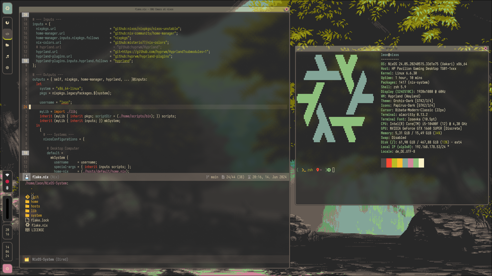

# Configuration Files For My NixOS-System

---

- **WM**:                [Hyprland](https://hyprland.org/)
- **Status-Bar**:        [Waybar](https://github.com/Alexays/Waybar)
- **Text-Editor**:       [Emacs](https://www.gnu.org/software/emacs/)
- **Terminal Emulator**: [Alacritty](https://alacritty.org/)
- **Shell**:             [Zsh]()
- **Wallpaper**:         [Source](https://gruvbox-wallpapers.pages.dev/wallpapers/pixelart/gruvbox_image46.png)
